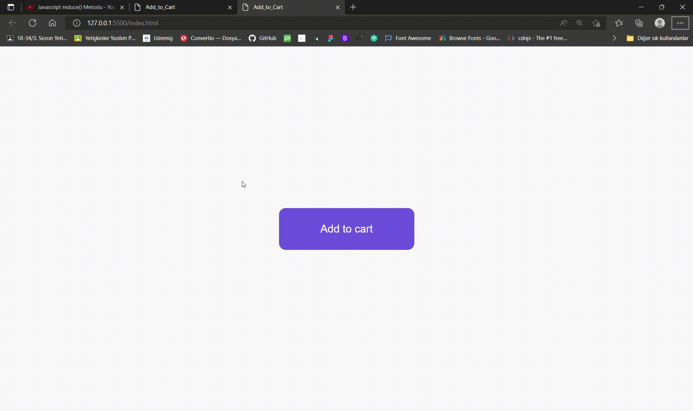

# Add_to_Cart

<h1>What is it about?
<h6>Indisposable part of e-commerce websites is sale process of dealers. 
As a matter of course in case of buying, it is important to make the page atractive visually in particular. 
This "button work" is a step to manage this aim with high quality... 

<h3>How it's made?
<h6>It has been taken advantage of <u>animation keyframes</u> in css. As the button is clicked, the animation is actived by using the features of Javascript.
